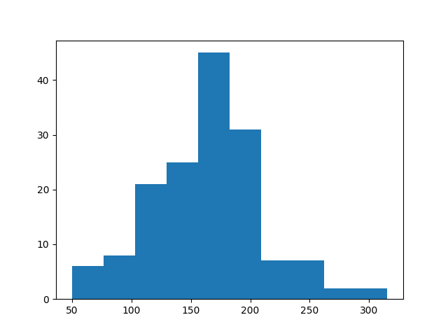

# Problem 1: Functional HEP

## Introduction
In this problem we focus on using Python as a functional language because of the special requirements in HEP computing.
There is usually very long dataset which could be assumed as infinite for practical purposes. Usual procedural ways are 
unsuitable for this application since they will consume a lot of time to process the entire dataset before going to the 
next step. Functional programming eliminates this by allowing us to define operations on infinite lists and evaluate 
selected subset of the data when required.

## The Problem
The requirement is specified as follows,

> "Some pairs of electrons come from Z bosons, some pairs of muons come from Z bosons, and some pairs of Z bosons come 
> from Higgs bosons. Write a functional analysis chain that identifies Higgs bosons."

We have to identify and select events where Higgs Boson is likely generated and try to observe a mass peak around the 
theorized mass of Higgs. But as Jim mentioned the dataset is simulated such that each event produces one Higgs, 
accounting for the failure in detectors we will drop certain events which do not meet the minimum requirements to 
indicate a Higgs.

Also it is important to notice that we are only focusing on H to ZZ decay mode.

## The Solution

First we will import the required libraries.
```python
import uproot
import oamap.source.root
import functional
import matplotlib.pyplot as plt
from math import sqrt
```

One may noticed that I have imported only the required sqrt from math library eventhough `from math import *` is used 
in the problem statement. I'm afraid importing all from math will increase the size of compiled code which might 
consume more memory. I have observed such instances when solving IEEExtreme coding competition problems.

Then we will load the HZZ.root dataset.
```python
events = uproot.open("http://scikit-hep.org/uproot/examples/HZZ.root")["events"].oamap()
```

Then we will do the renaming,
```python
events.schema.content.rename("NElectron", "electrons")
events.schema.content["electrons"].content.rename("Electron_Px", "px")
events.schema.content["electrons"].content.rename("Electron_Py", "py")
events.schema.content["electrons"].content.rename("Electron_Pz", "pz")
events.schema.content["electrons"].content.rename("Electron_E", "energy")
events.schema.content["electrons"].content.rename("Electron_Iso", "isolation")
events.schema.content["electrons"].content.rename("Electron_Charge", "charge")
events.schema.content.rename("NMuon", "muons")
events.schema.content["muons"].content.rename("Muon_Px", "px")
events.schema.content["muons"].content.rename("Muon_Py", "py")
events.schema.content["muons"].content.rename("Muon_Pz", "pz")
events.schema.content["muons"].content.rename("Muon_E", "energy")
events.schema.content["muons"].content.rename("Muon_Iso", "isolation")
events.schema.content["muons"].content.rename("Muon_Charge", "charge")
events.schema.content.rename("NPhoton", "photons")
events.schema.content["photons"].content.rename("Photon_Px", "px")
events.schema.content["photons"].content.rename("Photon_Py", "py")
events.schema.content["photons"].content.rename("Photon_Pz", "pz")
events.schema.content["photons"].content.rename("Photon_E", "energy")
events.schema.content["photons"].content.rename("Photon_Iso", "isolation")
events.schema.content.rename("NJet", "jets")
events.schema.content["jets"].content.rename("Jet_Px", "px")
events.schema.content["jets"].content.rename("Jet_Py", "py")
events.schema.content["jets"].content.rename("Jet_Pz", "pz")
events.schema.content["jets"].content.rename("Jet_E", "energy")
events.schema.content["jets"].content.rename("Jet_ID", "id")
events.schema.content["jets"].content.rename("Jet_btag", "btag")
events.regenerate()
```

The following is the function given in the problem statement to compute a particle's mass,
```python
def mass(*particles):
    energy = particles.map(lambda particle: particle.energy).sum
    px = particles.map(lambda particle: particle.px).sum
    py = particles.map(lambda particle: particle.py).sum
    pz = particles.map(lambda particle: particle.pz).sum
    return sqrt(energy**2 - px**2 - py**2 - pz**2)
```

The following is the functional chain I have written to identify Higgs Boson.
```python
masses = (events
           .lazy
           .filter(lambda event: (event.muons.size >= 2 and event.electrons.size >= 2) or event.muons.size >= 4 or event.electrons.size >= 4)
           .map(lambda event: [event.muons.pairs(mass), event.electrons.pairs(mass)]
                .flatten
                .pairs(lambda x, y: [x, y].sum)
                )
          .flatten
           )
```
The following are the steps followed,

1. Filter the events to take only the events with at least 4 muons, or 4 electrons, or 2 muons and 2 electrons.
2. take pairs among muons and electrons separately and find their progenitor mass
3. Now mix the sums from muons and electrons
4. take pairwise sum.

The reasons for each step are as follows,
1. Since Higgs decays into 2 Z bosons which in turn decays into two electrons or two muons each a possible candidate 
event should have 4 electrons or 4 muons or 2 electrons and 2 muons at minimum. 1 electron 3 muon or 1 muon 3 electron 
events are also rejected since Z boson decays into 2 electrons or 2 muons but not 1 electron and 1 muon.
2. This step is to find mass of possible Z bosons
3. Since there is no natural pairs in the Z boson candidates we will mix all the Z boson candidates from an event to 
look for Higgs
4. Possible Higgs masses

## Results
A histogram using the elements of the masses array was drawn using,
```python
plt.hist(masses.take(10000))
plt.show()
```
The following image shows the histogram,


Here we can see a mass peak between 150-175 GeV. Since this dataset was simulated before the discovery of Higgs boson 
at 125GeV this offset is acceptable.
